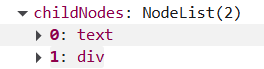
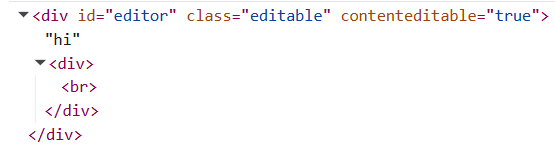

# Notes

## Exploring the .editor element via the keyup event

```js
function getLines(event) {
	// plan - check children?
	console.log(event);
}
/*
  Type "hi\n" (replace \n with an actual new line... i.e press Enter)
  Look through event instance for target and then scroll down for childNodes and children
  Note the firstChild is a text node, but the firstElementChild is a div.
*/
```




```js
function getLines(event) {
	// plan - check children?
	console.dir(event.target);
}

/*
 Type "hi\n" (replace \n with an actual new line... i.e press Enter)
*/
```



### Observations

#### Basic HTML Structure

The key thing to note is that we want to work with childNodes, this allows us to move and track our cursor through different HTML elements. At the simplest demo we see that a new line can take two formats.

```html
<div><br /></div>
<!-- or -->
<div>content</div>
```

The examples above demonstrate the typical HTML structure of a new line.

Let's use the following example "\n\n". Replace each "\n" with a carriage return i.e. enter. The html looks like this.

```html
<br />
<div><br /></div>
<div><br /></div>
<!-- notice an extra line here. Browsers typically add an extra line at the end -->
```

Let's now use the example "\nhi"

```html
<br />
<div>hi</div>
<!-- Technically "hi" is a child node of the div of the type text -->
```

We can recurse through each element and check it's nodes by type with:

```js
const node = el.childNodes[0]l
  if (node === Node.TEXT_NODE) {
    // do thing for text
  }
  if (node === Node.ELEMENT_NODE) {
    // do thing for element
  }
```

#### More Advanced HTML Structure

Sometimes there may be a reason to add special text elements inside a line. A line is marked always by the \<div>\</div> elements.

Child nodes are either simply \<br> meaning no content whatsover or they can be a div containing an array(like) list of childNodes like [text node, span]. Remember to use Array.from() to convert to array.

### Code History

#### Finding the current line index

This challenge proved difficult. Here was the first iteration of something that was close to working.

```js
function getCurrentLineIndex(editor, range) {
	const node = range.startContainer;
	const childNodes = editor.childNodes;
	return Array.from(childNodes).findIndex((el) => el === node);
}
```

The problem with this is that when the startContainer moves to a text node within the div, this code breaks! Solution below

```js
/**
 * Returns current line index
 *
 * Note: editor.childNodes lists each line. By default presents as [text, div, div, div...]
 * We know that when node.parentNode is equal to editor we can use editor.childNodes to find the index which contains the original startContainer
 *
 * @param {HTMLElement} editor
 * @param {Range} range
 * @returns {number} The index of the line number that the startContainer belongs to.
 */
function getCurrentLineIndex(editor, range) {
	// keep helper encapsulated for now
	function findCurrentEditorChild(editor, node) {
		// if node parent is not div editor, set node to parent - repeat. when node parent is editor, then return node
		while (NOT(node.parentNode === editor)) {
			node = node.parentNode;
		}
		return node;
	}

	const node = range.startContainer;
	if (node === editor) {
		return 0;
	}
	const currentEditorChild = findCurrentEditorChild(editor, node);
	return Array.from(editor.childNodes).findIndex(
		(node) => node === currentEditorChild,
	);
}
```

#### Observations on the selection / range object

When we make a selection for instance

```txt
hi there
```

We can highlight or create a selection. It doesn't matter how we do this we can use a mouse or our keyboard.

Let's say we highlight the word 'there'. The selection object will show:

```js
{
  focusOffset: 3,
  extentOffset: 3,
  baseOffset: 8,
  anchorOffset: 8,
  type: "Range",
}
```

If we check for the equality of range.startContainer === range.endContainer, we will get `true`.

Let's try another example - "Hi there,\nmy name is Buddy." - If we copy "there,\nmy name is Buddy." we see that range.startContainer === range.endContainer returns `false`, which makes sense because the editor child nodes are [text, div]. The second line belongs to a text node in the second div, whereas the first line belongs to the first text node.

Notice that focusNode and extentNode seem to point to the first line, but baseNode and anchor node both seem to point to the second line.

**Note - according to SO only anchorNode and focusNode are relevant. baseNode and extentNode are deprecated**

[Stack Overflow on anchorNode vs baseNode](https://stackoverflow.com/a/33586253/15592981)
